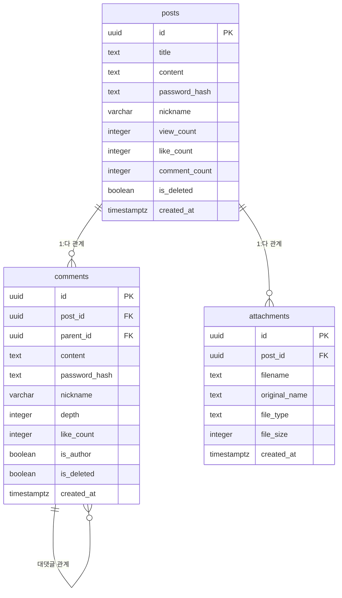

<div align="center">
  
</div>

# hit-secret


Nuxt.js와 Supabase로 구축된 진정한 익명 게시판 시스템으로, 완전한 사용자 익명성을 보장하도록 설계되었습니다.

## 핵심 익명성 특장점

- **회원가입 불필요**: 사용자 테이블이 존재하지 않아 근본적으로 사용자 추적 불가능
- **단방향 암호화**: bcrypt 해싱으로 비밀번호 해독이 불가능하여 특정 사용자 유추 차단
- **IP 추적 차단**: IP 주소를 데이터베이스나 로그에 일절 저장하지 않음
- **임시 닉네임**: 게시글/댓글마다 새로운 닉네임 사용으로 연관성 분석 불가
- **세션 추적 없음**: 지속적인 사용자 세션이나 쿠키를 사용하지 않음
- **로그 익명화**: 서버 로그에서 hostname, PID 등 모든 개인 식별 정보 자동 필터링

## 핵심 익명성 보장 기능

### 데이터베이스 레벨 익명성

- **사용자 테이블 없음**: 회원가입이나 로그인 시스템이 존재하지 않음
- **IP 주소 미저장**: IP 주소가 데이터베이스에 저장되지 않음
- **닉네임 기반 식별**: 게시글/댓글마다 임시 닉네임 사용
- **비밀번호 기반 소유권**: 사용자 추적 없이 간단한 비밀번호로 게시글/댓글 수정 가능
- **단방향 암호화**: bcrypt 해싱으로 비밀번호 해독이 불가능하여 특정 사용자 유추 차단

### 애플리케이션 레벨 익명성

- **익명 로깅**: 서버 로그에서 hostname, PID 등 식별 정보 제외
- **세션 추적 없음**: 지속적인 사용자 세션이나 쿠키 없음
- **프라이버시 우선 설계**: 모든 개인 식별 정보가 로그에서 필터링됨

### 인프라 레벨 익명성

- **최소 데이터 수집**: 기능에 필수적인 데이터만 저장
- **분석 추적 없음**: 사용자 행동 추적이나 분석 기능 없음
- **안전한 비밀번호 해싱**: 게시글/댓글 비밀번호의 안전한 해싱 처리

## 기술 스택

- **프론트엔드**: Nuxt.js 4, Vue 3, TypeScript
- **백엔드**: Nuxt Server API, Nitro
- **데이터베이스**: Supabase (PostgreSQL)
- **스타일링**: Tailwind CSS
- **아이콘**: Nuxt Icon을 통한 Lucide Icons
- **리치 텍스트**: Quill.js 에디터
- **테스팅**: Vitest + Playwright

## 프로젝트 구조

```
hit-secret/
├── components/           # Vue 컴포넌트
│   ├── CommentForm.vue      # 댓글 작성 폼
│   ├── CommentItem.vue      # 개별 댓글 표시
│   ├── CommentList.vue      # 대댓글 포함 댓글 스레드
│   ├── Post/                # 게시글 관련 컴포넌트
│   │   ├── PostContent.vue     # 게시글 내용 표시
│   │   ├── PostForm.vue        # 게시글 작성/수정
│   │   └── PostHeader.vue      # 게시글 메타데이터 표시
│   ├── Sidebar/             # 사이드바 컴포넌트
│   │   ├── BoardStats.vue      # 게시판 통계
│   │   ├── PopularPosts.vue    # 인기 게시글 위젯
│   │   └── RecentComments.vue  # 최근 댓글 위젯
│   └── ui/                  # 재사용 가능한 UI 컴포넌트
├── composables/          # Vue 컴포저블
│   ├── useComments.ts       # 댓글 관련 작업
│   ├── usePosts.ts          # 게시글 관련 작업
│   ├── useLikes.ts          # 좋아요 기능
│   └── useLocalStorage.ts   # 브라우저 저장소 유틸리티
├── pages/               # Nuxt 페이지 (파일 기반 라우팅)
│   ├── index.vue           # 메인 게시판 페이지
│   ├── post/
│   │   ├── create.vue       # 게시글 작성 페이지
│   │   └── [id]/
│   │       ├── index.vue     # 게시글 상세 페이지
│   │       └── edit.vue      # 게시글 수정 페이지
│   └── login.vue           # 간단한 비밀번호 보호
├── server/              # Nuxt 서버 사이드 코드
│   ├── api/                # API 엔드포인트
│   │   ├── posts/           # 게시글 관련 엔드포인트
│   │   ├── comments/        # 댓글 관련 엔드포인트
│   │   └── upload/          # 파일 업로드 엔드포인트
│   ├── middleware/         # 서버 미들웨어
│   │   ├── access-logger.ts  # 익명 접근 로깅
│   │   └── error-handler.ts  # 에러 처리
│   └── utils/              # 서버 유틸리티
├── utils/               # 공유 유틸리티
│   ├── logger.ts           # 익명 로깅 시스템
│   ├── imageUtils.ts       # 이미지 처리 유틸리티
│   └── nicknameGenerator.ts # 랜덤 닉네임 생성
├── middleware/          # Nuxt 미들웨어
│   └── auth.global.ts      # 간단한 사이트 전체 비밀번호 보호
├── supabase/           # 데이터베이스 관련 파일
│   ├── migrations/         # 데이터베이스 마이그레이션 파일
│   └── schema.sql          # 데이터베이스 스키마
└── tests/              # 테스트 파일
    ├── unit/               # 단위 테스트
    ├── e2e/                # E2E 테스트
    └── setup/              # 테스트 설정
```

## 데이터베이스 스키마

### 테이블 개요

데이터베이스는 익명성을 위해 설계된 3개의 주요 테이블로 구성됩니다:

#### posts (게시글)

완전한 익명성을 보장하는 게시글 저장 테이블

| 컬럼명           | 타입        | 설명                                     |
| ---------------- | ----------- | ---------------------------------------- |
| id               | uuid        | 기본키 (자동 생성)                       |
| title            | text        | 게시글 제목 (1-200자)                    |
| content          | text        | 게시글의 HTML 내용                       |
| preview          | text        | 자동 생성된 텍스트 미리보기 (최대 300자) |
| password_hash    | text        | 게시글 소유권을 위한 해시된 비밀번호     |
| nickname         | varchar     | 사용자 제공 닉네임 (최대 10자)           |
| plain_text       | text        | 검색용 플레인 텍스트 버전                |
| attached_files   | jsonb       | 첨부파일 메타데이터                      |
| view_count       | integer     | 조회수 (≥0)                              |
| like_count       | integer     | 좋아요 수 (≥0)                           |
| comment_count    | integer     | 댓글 수 (≥0)                             |
| has_attachments  | boolean     | 첨부파일 존재 여부                       |
| attachment_count | integer     | 첨부파일 개수 (≥0)                       |
| is_deleted       | boolean     | 소프트 삭제 플래그                       |
| deleted_at       | timestamptz | 삭제 시간                                |
| created_at       | timestamptz | 생성 시간                                |
| updated_at       | timestamptz | 마지막 수정 시간                         |
| last_comment_at  | timestamptz | 마지막 댓글 시간                         |

#### comments (댓글)

익명 설계가 적용된 계층형 댓글 시스템

| 컬럼명        | 타입        | 설명                                 |
| ------------- | ----------- | ------------------------------------ |
| id            | uuid        | 기본키 (자동 생성)                   |
| post_id       | uuid        | posts 테이블 외래키                  |
| parent_id     | uuid        | 대댓글을 위한 자기참조 외래키        |
| content       | text        | 댓글 내용 (1-1000자)                 |
| password_hash | text        | 댓글 소유권을 위한 해시된 비밀번호   |
| nickname      | varchar     | 사용자 제공 닉네임 (최대 10자)       |
| depth         | integer     | 중첩 깊이 (0-10레벨)                 |
| like_count    | integer     | 좋아요 수 (≥0)                       |
| reply_count   | integer     | 직접 답글 수 (≥0)                    |
| is_author     | boolean     | 댓글 작성자가 게시글 작성자인지 여부 |
| is_deleted    | boolean     | 소프트 삭제 플래그                   |
| deleted_at    | timestamptz | 삭제 시간                            |
| created_at    | timestamptz | 생성 시간                            |
| updated_at    | timestamptz | 마지막 수정 시간                     |

#### attachments (첨부파일)

사용자 식별 정보가 없는 파일 첨부 메타데이터

| 컬럼명        | 타입        | 설명                   |
| ------------- | ----------- | ---------------------- |
| id            | uuid        | 기본키 (자동 생성)     |
| post_id       | uuid        | posts 테이블 외래키    |
| filename      | text        | 시스템 파일명          |
| original_name | text        | 사용자 제공 파일명     |
| file_type     | text        | MIME 타입              |
| file_size     | integer     | 파일 크기 (바이트, >0) |
| storage_path  | text        | 파일 저장 위치         |
| is_image      | boolean     | 이미지 파일 여부       |
| created_at    | timestamptz | 업로드 시간            |

### 데이터베이스 관계도



## 설치 방법

### 사전 요구사항

- Node.js 18+
- npm 또는 yarn
- Supabase 계정

### 설치 과정

1. **저장소 클론**

   ```bash
   git clone https://github.com/your-org/hit-secret.git
   cd hit-secret
   ```

2. **의존성 설치**

   ```bash
   npm install
   ```

3. **환경 변수 설정**

   ```bash
   cp .env.example .env
   ```

   `.env` 파일 설정:

   ```env
   SUPABASE_URL=your_supabase_url
   SUPABASE_ANON_KEY=your_supabase_anon_key
   SITE_PASSWORD=your_site_password
   ```

4. **데이터베이스 설정**

   Supabase SQL 에디터에서 데이터베이스 마이그레이션 실행:

   ```bash
   # supabase/schema.sql의 스키마를 적용
   ```

5. **개발 서버 실행**

   ```bash
   npm run dev
   ```

   `http://localhost:3000`에서 애플리케이션 접근 가능

### 프로덕션 빌드

```bash
npm run build
npm run preview
```

## 테스트

```bash
# 단위 테스트
npm run test

# E2E 테스트
npm run test:e2e

# 테스트 UI
npm run test:ui
```

## 주요 기능

- **익명 게시**: 회원가입 없이 닉네임과 비밀번호만으로 게시
- **계층형 댓글**: 깊이 제어가 있는 중첩 답글 시스템
- **파일 첨부**: 이미지와 문서 지원
- **리치 텍스트 에디터**: 이미지 지원이 포함된 WYSIWYG 에디터
- **반응형 디자인**: 모바일 우선 반응형 인터페이스
- **실시간 업데이트**: 실시간 댓글 및 좋아요 개수 업데이트
- **검색 기능**: 게시글 전체 텍스트 검색
- **소프트 삭제**: 게시글과 댓글 복구 가능
- **속도 제한**: 스팸과 남용 방지

## 개인정보 보호 및 보안

- **IP 로깅 없음**: IP 주소가 데이터베이스나 로그에 저장되지 않음
- **익명 로깅**: 서버 로그에서 모든 개인 식별 정보 제외
- **비밀번호 보호**: 접근 제어를 위한 간단한 사이트 전체 비밀번호
- **안전한 해싱**: bcrypt를 사용한 모든 비밀번호의 안전한 해싱
- **입력 무해화**: XSS 방지를 위한 모든 사용자 입력 무해화
- **파일 업로드 보안**: 타입 검증이 포함된 안전한 파일 처리

## 데이터베이스 접근

Supabase 데이터베이스 스키마와 샘플 데이터를 검토할 수 있습니다. 검사나 테스트 목적으로 라이브 데이터베이스에 접근하고 싶으시면, 저에게 문의해 주세요.

## 기여하기

이 프로젝트는 익명 시스템 아키텍처의 데모 역할을 합니다. 익명성 기능을 유지하거나 향상시키는 기여를 환영합니다.

## 라이센스

이 프로젝트는 내부 사용 및 데모 목적으로 제작되었습니다.
