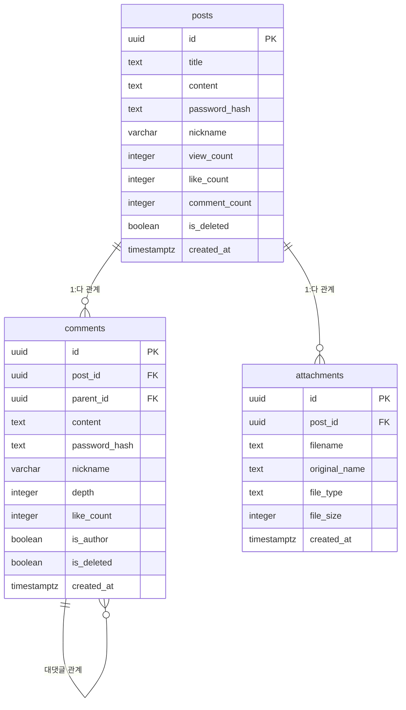

<div align="center">
  
</div>

# hit-secret


Nuxt.js와 Supabase로 구축된 익명 게시판 시스템입니다. 완전한 사용자 익명성 보장을 추구합니다.

## 주요 특징

### 🔒 완전한 익명성 보장
- **사용자 테이블 없음**: 회원가입 시스템 자체가 존재하지 않아 근본적으로 추적 불가능
- **IP 추적 차단**: IP 주소를 데이터베이스나 로그에 일절 저장하지 않음
- **세션 추적 없음**: 지속적인 세션이나 쿠키를 사용하지 않음
- **닉네임 기반 소유권**: 게시글/댓글마다 임시 닉네임 + 비밀번호로 간단한 소유권 관리
- **익명 로깅**: 서버 로그에서 개인 식별 정보를 완전히 제거

<details>
<summary>익명 접근 로그 형식 예시</summary>

애플리케이션은 익명성 보장을 위해 **최소 필드**만 접근 로그에 남깁니다:

```json
{"level":30,"time":"2025-08-13T01:42:51.775Z","type":"access","method":"GET","url":"/","userAgent":"Mozilla/5.0 (Windows NT 10.0; Win64; x64) AppleWebKit/537.36","responseTime":1907,"statusCode":500,"msg":"GET /"}
```

**포함되는 필드:**
- `time`: ISO 시간
- `method`, `url`: HTTP 메서드와 경로  
- `userAgent`: 브라우저 정보 (개인 식별 불가)
- `responseTime`: 처리 시간
- `statusCode`: 응답 상태

**의도적으로 제거되는 항목:**
- IP/remoteAddress/X-Forwarded-For
- 쿠키/세션 ID/Authorization 헤더
- 사용자 식별 토큰
- Geo/Location/Referrer 등 트래킹성 데이터

이 설계로 운영자는 트래픽 패턴만 관찰할 수 있고 **개별 사용자를 역추적할 수 없습니다.**
</details>

### 🤖 AI 지원 기능
- **AI 요약**: 긴 게시글을 자동으로 요약하여 빠른 내용 파악 지원
- **AI 말투 변환**: 다양한 말투로 자동 변환하여 개성 있는 글쓰기 지원

### 🌐 완전한 오픈소스
- **MIT 라이센스**: 자유로운 사용, 수정, 배포 가능
- **간편한 배포**: Supabase 프로젝트만 있으면 Vercel이나 Docker로 쉽게 배포

## 기술 스택

- **프론트엔드**: Nuxt.js 4, Vue 3, TypeScript
- **백엔드**: Nuxt Server API, Nitro
- **데이터베이스**: Supabase (PostgreSQL)
- **스타일링**: Tailwind CSS
- **아이콘**: Nuxt Icon을 통한 Lucide Icons
- **리치 텍스트**: Tiptap (ProseMirror 기반 커스터마이징 에디터)
- **테스팅**: Vitest + Playwright

## 프로젝트 구조

```
hit-secret/
├── components/          # Vue 컴포넌트
│   ├── editor/         # Tiptap 에디터 & 뷰어
│   ├── post/           # 게시글 관련 컴포넌트
│   ├── sidebar/        # 사이드바 위젯
│   └── ui/            # 공용 UI 컴포넌트
├── pages/              # 페이지 (파일 기반 라우팅)
├── server/api/         # API 엔드포인트
│   ├── posts/         # 게시글 API
│   ├── comments/      # 댓글 API
│   └── upload/        # 파일 업로드 API
├── composables/        # Vue 컴포저블
├── utils/             # 유틸리티 (logger 등)
├── types/             # TypeScript 타입 정의
├── tests/             # 테스트 코드
└── supabase/          # DB 스키마
```

## 데이터베이스 스키마

### 테이블 개요

데이터베이스는 익명성을 위해 설계된 3개의 주요 테이블로 구성됩니다:

#### posts (게시글)

완전한 익명성을 보장하는 게시글 저장 테이블

| 컬럼명           | 타입        | 설명                                     |
| ---------------- | ----------- | ---------------------------------------- |
| id               | uuid        | 기본키 (자동 생성)                       |
| title            | text        | 게시글 제목 (1-200자)                    |
| content          | text        | 게시글의 HTML 내용                       |
| preview          | text        | 자동 생성된 텍스트 미리보기 (최대 300자) |
| password_hash    | text        | 게시글 소유권을 위한 해시된 비밀번호     |
| nickname         | varchar     | 사용자 제공 닉네임 (최대 10자)           |
| plain_text       | text        | 검색용 플레인 텍스트 버전                |
| attached_files   | jsonb       | 첨부파일 메타데이터                      |
| view_count       | integer     | 조회수 (≥0)                              |
| like_count       | integer     | 좋아요 수 (≥0)                           |
| comment_count    | integer     | 댓글 수 (≥0)                             |
| has_attachments  | boolean     | 첨부파일 존재 여부                       |
| attachment_count | integer     | 첨부파일 개수 (≥0)                       |
| is_deleted       | boolean     | 소프트 삭제 플래그                       |
| deleted_at       | timestamptz | 삭제 시간                                |
| created_at       | timestamptz | 생성 시간                                |
| updated_at       | timestamptz | 마지막 수정 시간                         |
| last_comment_at  | timestamptz | 마지막 댓글 시간                         |

#### comments (댓글)

익명 설계가 적용된 계층형 댓글 시스템

| 컬럼명        | 타입        | 설명                                 |
| ------------- | ----------- | ------------------------------------ |
| id            | uuid        | 기본키 (자동 생성)                   |
| post_id       | uuid        | posts 테이블 외래키                  |
| parent_id     | uuid        | 대댓글을 위한 자기참조 외래키        |
| content       | text        | 댓글 내용 (1-1000자)                 |
| password_hash | text        | 댓글 소유권을 위한 해시된 비밀번호   |
| nickname      | varchar     | 사용자 제공 닉네임 (최대 10자)       |
| depth         | integer     | 중첩 깊이 (0-10레벨)                 |
| like_count    | integer     | 좋아요 수 (≥0)                       |
| reply_count   | integer     | 직접 답글 수 (≥0)                    |
| is_author     | boolean     | 댓글 작성자가 게시글 작성자인지 여부 |
| is_deleted    | boolean     | 소프트 삭제 플래그                   |
| deleted_at    | timestamptz | 삭제 시간                            |
| created_at    | timestamptz | 생성 시간                            |
| updated_at    | timestamptz | 마지막 수정 시간                     |

#### attachments (첨부파일)

사용자 식별 정보가 없는 파일 첨부 메타데이터

| 컬럼명        | 타입        | 설명                   |
| ------------- | ----------- | ---------------------- |
| id            | uuid        | 기본키 (자동 생성)     |
| post_id       | uuid        | posts 테이블 외래키    |
| filename      | text        | 시스템 파일명          |
| original_name | text        | 사용자 제공 파일명     |
| file_type     | text        | MIME 타입              |
| file_size     | integer     | 파일 크기 (바이트, >0) |
| storage_path  | text        | 파일 저장 위치         |
| is_image      | boolean     | 이미지 파일 여부       |
| created_at    | timestamptz | 업로드 시간            |

### 데이터베이스 관계도



## 설치 방법

### 사전 요구사항

- Node.js 18+
- npm 또는 yarn
- Supabase 계정

### 설치 과정

1. **저장소 클론**

   ```bash
   git clone https://github.com/your-org/hit-secret.git
   cd hit-secret
   ```

2. **의존성 설치**

   ```bash
   npm install
   ```

3. **환경 변수 설정**

   ```bash
   cp .env.example .env
   ```

   `.env` 파일 설정:

   ```env
   SUPABASE_URL=your_supabase_url
   SUPABASE_ANON_KEY=your_supabase_anon_key
   SITE_PASSWORD=your_site_password
   ```

4. **데이터베이스 설정**

   Supabase SQL 에디터에서 데이터베이스 마이그레이션 실행:

   ```bash
   # supabase/schema.sql의 스키마를 적용
   ```

5. **개발 서버 실행**

   ```bash
   npm run dev
   ```

   `http://localhost:3000`에서 애플리케이션 접근 가능

### Supabase 프로젝트 상세 셋업

1. Supabase 프로젝트 생성 (Region 선택 후 생성)
2. Project Settings > API 에서 `Project URL` / `anon public` 키 복사
3. SQL Editor 에서 `supabase/schema.sql` 내용 전체 실행 (필요 시 한 번 더 실행해 FK/Index 적용 확인)
4. (이미지 업로드 등 파일 사용 시) Storage > 새 Bucket 생성
   - 이름 예: `public`
   - Public 권한 허용 (또는 RLS 정책 별도 작성)
5. (선택) Storage RLS 정책이 켜져 있다면 최소 다음 정책 추가:
   - `SELECT/INSERT` 모두 `true;` 로 허용 (익명 게시판 특성)
6. (선택) 로컬 테스트 시 Supabase CLI 사용할 경우:
   ```bash
   npm i -g supabase
   supabase start # 로컬 컨테이너 실행
   ```

### 환경 변수 설정 (.env)

| 변수                   | 구분 | 설명                                              | 예시                     |
| ---------------------- | ---- | ------------------------------------------------- | ------------------------ |
| SUPABASE_URL           | 필수 | Supabase 프로젝트 URL                             | https://xxxx.supabase.co |
| SUPABASE_ANON_KEY      | 필수 | Supabase public anon key                          | eyJhbGciOiJI...          |
| SITE_PASSWORD          | 필수 | 사이트 진입 보호 비밀번호                         | mysecret                 |
| SERVER_API_KEY         | 필수 | 서버 내부 API 보호용 키                           | random-long-key          |
| AD_VISIBLE             | 선택 | 전체 광고 on/off (true/false)                     | true                     |
| AD_SIDEBAR_ENABLED     | 선택 | 사이드바 광고 on/off                              | true                     |
| AD_POST_DETAIL_ENABLED | 선택 | 게시글 상세 하단 광고 on/off                      | true                     |
| COUPANG_SIDEBAR_AD_URL | 선택 | 쿠팡 파트너스 사이드바 위젯 URL                   | https://coupa.ng/abc123  |
| COUPANG_POST_AD_URL    | 선택 | 게시글 하단 쿠팡 광고 URL                         | https://coupa.ng/def456  |

`.env.example` 파일을 복사하여 `.env` 생성 후 값을 설정하세요. 광고 기능이 필요 없다면 `AD_VISIBLE=false`로 설정하면 됩니다.

### Docker 로컬 빌드 & 실행

멀티 스테이지 Dockerfile 이 포함되어 있습니다.

핵심 내용 (요약):

```Dockerfile
FROM node:22-alpine AS builder
WORKDIR /app
RUN apk add --no-cache libc6-compat python3 make g++
COPY package*.json ./
RUN npm ci || npm install
COPY . .
RUN npm run build

FROM node:22-alpine AS runner
WORKDIR /app
ENV NODE_ENV=production HOST=0.0.0.0 PORT=3000
RUN apk add --no-cache libc6-compat
COPY --from=builder /app/.output ./.output
EXPOSE 3000
CMD ["node", ".output/server/index.mjs"]
```

로컬 단일 이미지 빌드 & 실행:

```bash
docker build -t hit-secret .
docker run --rm -p 3000:3000 \
    -e SUPABASE_URL=$SUPABASE_URL \
    -e SUPABASE_ANON_KEY=$SUPABASE_ANON_KEY \
    -e SITE_PASSWORD=$SITE_PASSWORD \
    -e SERVER_API_KEY=$SERVER_API_KEY \
    hit-secret
```

### docker-compose 프로덕션 배포 예시

`docker-compose.deploy.yml` 요약:

```yaml
version: "3.8"
services:
  hit-secret:
    build:
      context: .
      dockerfile: Dockerfile
    container_name: hit-secret
    volumes:
      - /home/ubuntu/workspace/apps/hit-secret/logs:/app/logs
    ports:
      - "3011:3000"
    environment:
      - NODE_ENV=production
      - SUPABASE_URL=${SUPABASE_URL}
      - SUPABASE_ANON_KEY=${SUPABASE_ANON_KEY}
      - SITE_PASSWORD=${SITE_PASSWORD}
      - SERVER_API_KEY=${SERVER_API_KEY}
    restart: unless-stopped
    networks:
      - infra-net
networks:
  infra-net:
    external: true
```

배포 절차 예:

```bash
docker compose -f docker-compose.deploy.yml build --pull
docker compose -f docker-compose.deploy.yml up -d
docker compose -f docker-compose.deploy.yml logs -f
```

로그 디렉토리 권한 문제 발생 시:

```bash
sudo mkdir -p /home/ubuntu/workspace/apps/hit-secret/logs
sudo chown -R $(whoami):$(whoami) /home/ubuntu/workspace/apps/hit-secret/logs
```

업데이트(롤링) 시:

```bash
git pull
docker compose -f docker-compose.deploy.yml build --no-cache
docker compose -f docker-compose.deploy.yml up -d
```

캐시 이슈(파일 누락 등) 의심 시 `--no-cache` 옵션을 사용하거나 Dockerfile 상단에 `ARG BUILD_REVISION=<date>` 등을 추가해 캐시 무효화 할 수 있습니다.

### 헬스체크 / 운영 팁

- (선택) nginx 앞단 배치 후 `/` 프록시, gzip/캐시 헤더 추가
- 로그 회전: 호스트에서 `logrotate` 대상에 /home/ubuntu/workspace/apps/hit-secret/logs/\*.log 추가
- 메트릭 필요 시 별도 reverse proxy 레벨에서 수집 (애플리케이션은 최소한의 정보만 유지)

### Nginx 리버스 프록시 예시 (서브패스 /secret/ 로 서비스)

다음 설정은 `hit-secret` 컨테이너(도커 네트워크 내 이름) 3000 포트를 `/secret/` 경로로 프록시합니다. 업로드/스트리밍을 위해 버퍼링을 줄이고 WebSocket 업그레이드를 허용합니다.

`/etc/nginx/conf.d/hit-secret.conf` 예시:

```nginx
upstream hit_secret_upstream {
   server hit-secret:3000;
   keepalive 64;
}

map $http_upgrade $connection_upgrade {
   default upgrade;
   ''      close;
}

server {
   listen 80;
   server_name _;

   # gzip (선택)
   gzip on;
   gzip_types text/plain text/css application/json application/javascript application/xml+rss application/xml image/svg+xml;
   gzip_min_length 512;

   # 메인 애플리케이션 서브패스 매핑
   location /secret/ {
      proxy_pass http://hit-secret:3000/secret/;
      proxy_http_version 1.1;

      # 필수 헤더 (IP 익명성 유지 위해 백엔드에서 무시하거나 저장 금지)
      proxy_set_header Host              $host;
      proxy_set_header X-Forwarded-Proto $scheme;
      proxy_set_header X-Forwarded-Host  $host;
      # 아래 두 줄은 클라이언트 IP 를 전달하므로 완전한 익명성 정책이라면 제거 가능
      proxy_set_header X-Real-IP         $remote_addr;          # 필요시만
      proxy_set_header X-Forwarded-For   $proxy_add_x_forwarded_for; # 필요시만

      # WebSocket / HMR / 업그레이드
      proxy_set_header Upgrade           $http_upgrade;
      proxy_set_header Connection        $connection_upgrade;

      # 업로드 성능
      client_max_body_size           100m;
      client_body_buffer_size        128k;
      proxy_request_buffering        off;        # chunked 업로드
      proxy_buffering                off;        # 실시간 전송 (필요 시 on)

      proxy_connect_timeout          90;
      proxy_send_timeout             90;
      proxy_read_timeout             90;

      # 캐시 제어 (SSR 응답은 기본 no-store, 정적 자산에만 별도 location 사용 권장)
      add_header X-Frame-Options DENY;
      add_header X-Content-Type-Options nosniff;
      add_header Referrer-Policy strict-origin-when-cross-origin;
   }

   # 정적 자산 직접 서빙 예 (Nuxt .output/public 가 /_nuxt 등으로 반영될 경우)
   # location /_nuxt/ { proxy_pass http://hit-secret:3000/_nuxt/; proxy_cache static_cache; }
}
```

익명성 강화하려면 `X-Real-IP`, `X-Forwarded-For` 전달 라인을 제거하거나 백엔드 로거에서 해당 필드 무시하도록 유지하세요.

서브패스(`/secret/`)가 아닌 루트(`/`) 제공을 원한다면 `location / { proxy_pass http://hit-secret:3000/; }` 로 단순화하면 됩니다.

### Vercel 배포

Vercel을 사용한 간편한 배포 방법입니다.

**1. 배포 준비**
```bash
# GitHub 저장소에 코드 푸시
git add .
git commit -m "Deploy to Vercel"
git push origin main
```

**2. Vercel 프로젝트 생성**
- [Vercel 대시보드](https://vercel.com/dashboard)에서 "New Project" 클릭
- GitHub 저장소 연결 및 선택
- Framework Preset: **Nuxt.js** 자동 감지됨
- Root Directory: 루트 디렉토리 그대로 사용

**3. 환경 변수 설정**
Vercel 프로젝트 설정 > Environment Variables에서 다음 변수들을 추가:

```bash
SUPABASE_URL=https://your-project.supabase.co
SUPABASE_ANON_KEY=your-anon-key
SITE_PASSWORD=your-site-password
SERVER_API_KEY=your-random-api-key
```

**4. 배포 실행**
- "Deploy" 버튼 클릭하면 자동으로 빌드 및 배포 진행
- 완료 후 제공되는 URL로 접속 가능

**5. 도메인 설정 (선택)**
- Project Settings > Domains에서 커스텀 도메인 연결 가능
- Vercel은 자동으로 HTTPS 인증서를 제공

**업데이트 방법:**
```bash
git push origin main  # GitHub에 푸시하면 자동으로 재배포됨
```

---

## 테스트

### 프로덕션 빌드
```bash
npm run build
npm run preview
```

### 테스트 실행
```bash
# 단위 테스트
npm run test

# E2E 테스트
npm run test:e2e

# 테스트 UI
npm run test:ui
```

## 데이터베이스 접근

Supabase 데이터베이스 스키마와 샘플 데이터를 검토할 수 있습니다. 검사나 테스트 목적으로 라이브 데이터베이스에 접근하고 싶으시면, 저에게 문의해 주세요.

## 라이센스

이 프로젝트는 [MIT License](./LICENSE)를 따릅니다.\
자유로운 사용 / 복제 / 수정 / 배포가 가능하며, 저작권 및 라이선스 전문 고지를 유지해야 합니다.

배포본 혹은 파생 작업물에는 아래 고지를 포함해주세요:

```
Copyright (c) 2025 isnow890

Released under the MIT License. See LICENSE for details.
```

배지: 
