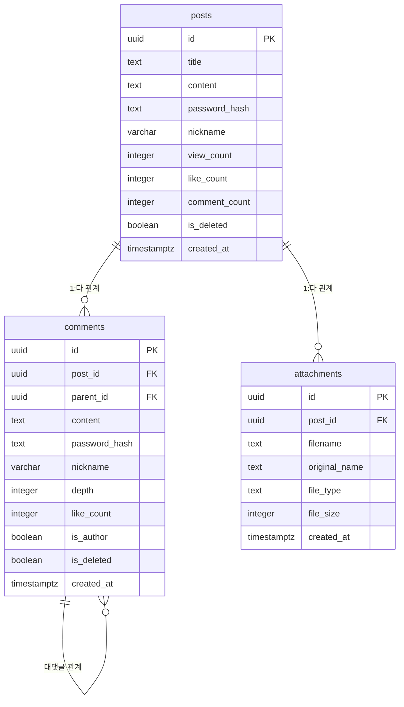

<div align="center">
  
</div>

# hit-secret


Nuxt.js와 Supabase로 구축된 진정한 익명 게시판 시스템으로, 완전한 사용자 익명성을 보장하도록 설계되었습니다.

## 특징

- **회원가입 불필요**: 사용자 테이블이 존재하지 않아 근본적으로 사용자 추적 불가능
- **단방향 암호화**: bcrypt 해싱으로 비밀번호 해독이 불가능하여 특정 사용자 유추 차단
- **IP 추적 차단**: IP 주소를 데이터베이스나 로그에 일절 저장하지 않음
- **임시 닉네임**: 게시글/댓글마다 새로운 닉네임 사용으로 연관성 분석 불가
- **세션 추적 없음**: 지속적인 사용자 세션이나 쿠키를 사용하지 않음
- **로그 익명화**: 서버 로그에서 hostname, PID 등 모든 개인 식별 정보 자동 필터링

## 핵심 익명성 보장 기능

### 데이터베이스 레벨 익명성

- **사용자 테이블 없음**: 회원가입이나 로그인 시스템이 존재하지 않음
- **IP 주소 미저장**: IP 주소가 데이터베이스에 저장되지 않음
- **닉네임 기반 식별**: 게시글/댓글마다 임시 닉네임 사용
- **비밀번호 기반 소유권**: 사용자 추적 없이 간단한 비밀번호로 게시글/댓글 수정 가능
- **단방향 암호화**: bcrypt 해싱으로 비밀번호 해독이 불가능하여 특정 사용자 유추 차단

### 애플리케이션 레벨 익명성

- **익명 로깅**: 서버 로그에서 hostname, PID 등 식별 정보 제외
- **세션 추적 없음**: 지속적인 사용자 세션이나 쿠키 없음
- **프라이버시 우선 설계**: 모든 개인 식별 정보가 로그에서 필터링됨

### 인프라 레벨 익명성

- **최소 데이터 수집**: 기능에 필수적인 데이터만 저장
- **분석 추적 없음**: 사용자 행동 추적이나 분석 기능 없음
- **안전한 비밀번호 해싱**: 게시글/댓글 비밀번호의 안전한 해싱 처리

## 기술 스택

- **프론트엔드**: Nuxt.js 4, Vue 3, TypeScript
- **백엔드**: Nuxt Server API, Nitro
- **데이터베이스**: Supabase (PostgreSQL)
- **스타일링**: Tailwind CSS
- **아이콘**: Nuxt Icon을 통한 Lucide Icons
- **리치 텍스트**: Tiptap (ProseMirror 기반 커스터마이징 에디터)
- **테스팅**: Vitest + Playwright

## 프로젝트 구조

```
hit-secret/
├── app.vue
├── nuxt.config.ts
├── Dockerfile
├── docker-compose.deploy.yml
├── components/
│   ├── editor/                 # Tiptap 에디터 & 뷰어
│   │   ├── TiptapEditor.vue
│   │   └── TiptapViewer.vue
│   ├── post/                   # 게시글 UI 컴포넌트
│   │   ├── PostContent.vue
│   │   ├── PostDetailActions.vue
│   │   ├── PostForm.vue
│   │   ├── PostFormActions.vue
│   │   ├── PostHeader.vue
│   │   ├── PostItem.vue
│   │   ├── PostList.vue
│   │   ├── PostListEmpty.vue
│   │   ├── PostListPagination.vue
│   │   └── PostListSkeleton.vue
│   ├── sidebar/                # 사이드바 관련 (예: 통계, 인기글 등)
│   ├── ui/                     # 공용 UI 컴포넌트
│   ├── ads/                    # 광고/배너 관련 (예약)
│   └── layout/                 # 레이아웃 보조 컴포넌트
├── composables/
│   ├── useComments.ts
│   ├── useCommentLikes.ts
│   ├── usePosts.ts
│   ├── usePostActions.ts
│   ├── usePostEditor.ts
│   ├── usePostFormValidation.ts
│   ├── useLikes.ts
│   ├── useImageUpload.ts
│   ├── useDraftManager.ts
│   ├── useCodeBlockHeaders.ts
│   ├── useTiptapCommon.ts
│   ├── useSidebar.ts
│   ├── useToast.ts
│   ├── useLogger.ts
│   ├── useLocalStorage.ts
│   └── useUtils.ts
├── pages/
│   ├── index.vue
│   ├── login.vue
│   ├── privacy.vue              # 개인정보 관련 고지
│   ├── terms.vue                # 이용 약관
│   ├── test-error.vue           # 에러 테스트 페이지
│   └── post/
│       ├── create.vue
│       └── [id]/
│           ├── index.vue        # 게시글 상세
│           └── edit.vue         # 게시글 수정
├── server/
│   └── api/
│       ├── posts/
│       │   ├── index.get.ts
│       │   ├── index.post.ts
│       │   ├── trending.get.ts
│       │   ├── [id].get.ts
│       │   ├── [id].delete.ts
│       │   └── [id]/
│       │       ├── edit.post.ts
│       │       ├── like.post.ts
│       │       ├── verify.post.ts
│       │       └── view.post.ts
│       ├── comments/
│       │   ├── index.post.ts
│       │   ├── recent.get.ts
│       │   ├── [postId].get.ts
│       │   └── [commentId]/
│       │       ├── edit.post.ts
│       │       ├── delete.post.ts
│       │       ├── like.post.ts
│       │       └── verify.post.ts
│       ├── upload/
│       │   ├── file.post.ts
│       │   └── image.post.ts
│       ├── log/
│       │   └── client-error.post.ts
│       └── stats/
│           └── board.get.ts
├── middleware/
│   └── auth.global.ts
├── utils/
│   ├── clipboardUtils.ts
│   ├── imageCompression.ts
│   ├── imageUtils.ts
│   ├── logger.ts
│   └── nicknameGenerator.ts
├── types/
│   ├── index.ts
│   ├── supabase.ts
│   ├── domains/
│   │   ├── api.ts
│   │   ├── auth.ts
│   │   ├── comment.ts
│   │   ├── post.ts
│   │   ├── ui.ts
│   │   └── upload.ts
│   └── shared/
│       ├── common.ts
│       └── editor.ts
├── tests/
│   ├── api/
│   ├── e2e/
│   ├── unit/
│   │   └── components/
│   │       └── editor/
│   │           └── TiptapEditor.test.ts
│   ├── utils/
│   ├── setup/
│   └── types/
└── supabase/
   └── schema.sql
```

## 데이터베이스 스키마

### 테이블 개요

데이터베이스는 익명성을 위해 설계된 3개의 주요 테이블로 구성됩니다:

#### posts (게시글)

완전한 익명성을 보장하는 게시글 저장 테이블

| 컬럼명           | 타입        | 설명                                     |
| ---------------- | ----------- | ---------------------------------------- |
| id               | uuid        | 기본키 (자동 생성)                       |
| title            | text        | 게시글 제목 (1-200자)                    |
| content          | text        | 게시글의 HTML 내용                       |
| preview          | text        | 자동 생성된 텍스트 미리보기 (최대 300자) |
| password_hash    | text        | 게시글 소유권을 위한 해시된 비밀번호     |
| nickname         | varchar     | 사용자 제공 닉네임 (최대 10자)           |
| plain_text       | text        | 검색용 플레인 텍스트 버전                |
| attached_files   | jsonb       | 첨부파일 메타데이터                      |
| view_count       | integer     | 조회수 (≥0)                              |
| like_count       | integer     | 좋아요 수 (≥0)                           |
| comment_count    | integer     | 댓글 수 (≥0)                             |
| has_attachments  | boolean     | 첨부파일 존재 여부                       |
| attachment_count | integer     | 첨부파일 개수 (≥0)                       |
| is_deleted       | boolean     | 소프트 삭제 플래그                       |
| deleted_at       | timestamptz | 삭제 시간                                |
| created_at       | timestamptz | 생성 시간                                |
| updated_at       | timestamptz | 마지막 수정 시간                         |
| last_comment_at  | timestamptz | 마지막 댓글 시간                         |

#### comments (댓글)

익명 설계가 적용된 계층형 댓글 시스템

| 컬럼명        | 타입        | 설명                                 |
| ------------- | ----------- | ------------------------------------ |
| id            | uuid        | 기본키 (자동 생성)                   |
| post_id       | uuid        | posts 테이블 외래키                  |
| parent_id     | uuid        | 대댓글을 위한 자기참조 외래키        |
| content       | text        | 댓글 내용 (1-1000자)                 |
| password_hash | text        | 댓글 소유권을 위한 해시된 비밀번호   |
| nickname      | varchar     | 사용자 제공 닉네임 (최대 10자)       |
| depth         | integer     | 중첩 깊이 (0-10레벨)                 |
| like_count    | integer     | 좋아요 수 (≥0)                       |
| reply_count   | integer     | 직접 답글 수 (≥0)                    |
| is_author     | boolean     | 댓글 작성자가 게시글 작성자인지 여부 |
| is_deleted    | boolean     | 소프트 삭제 플래그                   |
| deleted_at    | timestamptz | 삭제 시간                            |
| created_at    | timestamptz | 생성 시간                            |
| updated_at    | timestamptz | 마지막 수정 시간                     |

#### attachments (첨부파일)

사용자 식별 정보가 없는 파일 첨부 메타데이터

| 컬럼명        | 타입        | 설명                   |
| ------------- | ----------- | ---------------------- |
| id            | uuid        | 기본키 (자동 생성)     |
| post_id       | uuid        | posts 테이블 외래키    |
| filename      | text        | 시스템 파일명          |
| original_name | text        | 사용자 제공 파일명     |
| file_type     | text        | MIME 타입              |
| file_size     | integer     | 파일 크기 (바이트, >0) |
| storage_path  | text        | 파일 저장 위치         |
| is_image      | boolean     | 이미지 파일 여부       |
| created_at    | timestamptz | 업로드 시간            |

### 데이터베이스 관계도


```mermaid
erDiagram
    posts {
        uuid id PK
        text title
        text content
        text password_hash
        varchar nickname
        integer view_count
        integer like_count
        integer comment_count
        boolean is_deleted
        timestamptz created_at
    }

    comments {
        uuid id PK
        uuid post_id FK
        uuid parent_id FK
        text content
        text password_hash
        varchar nickname
        integer depth
        integer like_count
        boolean is_author
        boolean is_deleted
        timestamptz created_at
    }

    attachments {
        uuid id PK
        uuid post_id FK
        text filename
        text original_name
        text file_type
        integer file_size
        timestamptz created_at
    }

    posts ||--o{ comments : "1:다 관계"
    posts ||--o{ attachments : "1:다 관계"
    comments ||--o{ comments : "대댓글 관계"
```

## 설치 방법

### 사전 요구사항

- Node.js 18+
- npm 또는 yarn
- Supabase 계정

### 설치 과정

1. **저장소 클론**

   ```bash
   git clone https://github.com/your-org/hit-secret.git
   cd hit-secret
   ```

2. **의존성 설치**

   ```bash
   npm install
   ```

3. **환경 변수 설정**

   ```bash
   cp .env.example .env
   ```

   `.env` 파일 설정:

   ```env
   SUPABASE_URL=your_supabase_url
   SUPABASE_ANON_KEY=your_supabase_anon_key
   SITE_PASSWORD=your_site_password
   ```

4. **데이터베이스 설정**

   Supabase SQL 에디터에서 데이터베이스 마이그레이션 실행:

   ```bash
   # supabase/schema.sql의 스키마를 적용
   ```

5. **개발 서버 실행**

   ```bash
   npm run dev
   ```

   `http://localhost:3000`에서 애플리케이션 접근 가능

### Supabase 프로젝트 상세 셋업

1. Supabase 프로젝트 생성 (Region 선택 후 생성)
2. Project Settings > API 에서 `Project URL` / `anon public` 키 복사
3. SQL Editor 에서 `supabase/schema.sql` 내용 전체 실행 (필요 시 한 번 더 실행해 FK/Index 적용 확인)
4. (이미지 업로드 등 파일 사용 시) Storage > 새 Bucket 생성
   - 이름 예: `public`
   - Public 권한 허용 (또는 RLS 정책 별도 작성)
5. (선택) Storage RLS 정책이 켜져 있다면 최소 다음 정책 추가:
   - `SELECT/INSERT` 모두 `true;` 로 허용 (익명 게시판 특성)
6. (선택) 로컬 테스트 시 Supabase CLI 사용할 경우:
   ```bash
   npm i -g supabase
   supabase start # 로컬 컨테이너 실행
   ```

### 필수 / 선택 환경 변수 (.env)

광고(쿠팡 파트너스) 및 선택 기능을 모두 포함한 전체 변수 목록입니다. 실제로 필요 없는 항목은 제거하거나 비워도 됩니다.

| 변수                   | 구분 | 설명                                              | 예시                     |
| ---------------------- | ---- | ------------------------------------------------- | ------------------------ |
| SUPABASE_URL           | 필수 | Supabase 프로젝트 URL                             | https://xxxx.supabase.co |
| SUPABASE_ANON_KEY      | 필수 | Supabase public anon key                          | eyJhbGciOiJI...          |
| SITE_PASSWORD          | 필수 | 사이트 진입 보호 비밀번호 (전체 잠금)             | mysecret                 |
| SERVER_API_KEY         | 필수 | 서버 내부 보호용 커스텀 키 (클라이언트 전송 금지) | random-long-key          |
| TINY_API_KEY           | 선택 | 이미지 압축 / 에디터 처리 외부 서비스 키          | your_tiny_key            |
| NAVER_CLIENT_ID        | 선택 | 네이버 API 사용 시                                | xxxx                     |
| NAVER_CLIENT_SECRET    | 선택 | 네이버 API 시크릿                                 | yyyy                     |
| AD_VISIBLE             | 선택 | 전체 광고 on/off (true/false)                     | true                     |
| AD_SIDEBAR_ENABLED     | 선택 | 사이드바 광고 on/off                              | true                     |
| AD_POST_DETAIL_ENABLED | 선택 | 게시글 상세 하단 광고 on/off                      | true                     |
| COUPANG_SIDEBAR_AD_URL | 선택 | 쿠팡 파트너스 사이드바 위젯 URL                   | https://coupa.ng/abc123  |
| COUPANG_POST_AD_URL    | 선택 | 게시글 하단 쿠팡 광고 URL                         | https://coupa.ng/def456  |

`.env.example` 파일을 복사하여 `.env` 생성 후 값 채워주세요. 광고를 완전히 비활성화하려면 `AD_VISIBLE=false` 로 설정하거나 관련 변수들을 제거하면 됩니다.

`.env.example` 파일을 복사하여 `.env` 생성 후 값 채워주세요.

### Docker 로컬 빌드 & 실행

멀티 스테이지 Dockerfile 이 포함되어 있습니다.

핵심 내용 (요약):

```Dockerfile
FROM node:22-alpine AS builder
WORKDIR /app
RUN apk add --no-cache libc6-compat python3 make g++
COPY package*.json ./
RUN npm ci || npm install
COPY . .
RUN npm run build

FROM node:22-alpine AS runner
WORKDIR /app
ENV NODE_ENV=production HOST=0.0.0.0 PORT=3000
RUN apk add --no-cache libc6-compat
COPY --from=builder /app/.output ./.output
EXPOSE 3000
CMD ["node", ".output/server/index.mjs"]
```

로컬 단일 이미지 빌드 & 실행:

```bash
docker build -t hit-secret .
docker run --rm -p 3000:3000 \
    -e SUPABASE_URL=$SUPABASE_URL \
    -e SUPABASE_ANON_KEY=$SUPABASE_ANON_KEY \
    -e SITE_PASSWORD=$SITE_PASSWORD \
    hit-secret
```

### docker-compose 프로덕션 배포 예시

`docker-compose.deploy.yml` 요약:

```yaml
version: "3.8"
services:
  hit-secret:
    build:
      context: .
      dockerfile: Dockerfile
    container_name: hit-secret
    volumes:
      - /home/ubuntu/workspace/apps/hit-secret/logs:/app/logs
    ports:
      - "3011:3000"
    environment:
      - NODE_ENV=production
      - SUPABASE_URL=${SUPABASE_URL}
      - SUPABASE_ANON_KEY=${SUPABASE_ANON_KEY}
      - SITE_PASSWORD=${SITE_PASSWORD}
      - TINY_API_KEY=${TINY_API_KEY}
      - NAVER_CLIENT_ID=${NAVER_CLIENT_ID}
      - NAVER_CLIENT_SECRET=${NAVER_CLIENT_SECRET}
      - SERVER_API_KEY=${SERVER_API_KEY}
    restart: unless-stopped
    networks:
      - infra-net
networks:
  infra-net:
    external: true
```

배포 절차 예:

```bash
docker compose -f docker-compose.deploy.yml build --pull
docker compose -f docker-compose.deploy.yml up -d
docker compose -f docker-compose.deploy.yml logs -f
```

로그 디렉토리 권한 문제 발생 시:

```bash
sudo mkdir -p /home/ubuntu/workspace/apps/hit-secret/logs
sudo chown -R $(whoami):$(whoami) /home/ubuntu/workspace/apps/hit-secret/logs
```

업데이트(롤링) 시:

```bash
git pull
docker compose -f docker-compose.deploy.yml build --no-cache
docker compose -f docker-compose.deploy.yml up -d
```

캐시 이슈(파일 누락 등) 의심 시 `--no-cache` 옵션을 사용하거나 Dockerfile 상단에 `ARG BUILD_REVISION=<date>` 등을 추가해 캐시 무효화 할 수 있습니다.

### 헬스체크 / 운영 팁

- (선택) nginx 앞단 배치 후 `/` 프록시, gzip/캐시 헤더 추가
- 로그 회전: 호스트에서 `logrotate` 대상에 /home/ubuntu/workspace/apps/hit-secret/logs/\*.log 추가
- 메트릭 필요 시 별도 reverse proxy 레벨에서 수집 (애플리케이션은 최소한의 정보만 유지)

### Nginx 리버스 프록시 예시 (서브패스 /secret/ 로 서비스)

다음 설정은 `hit-secret` 컨테이너(도커 네트워크 내 이름) 3000 포트를 `/secret/` 경로로 프록시합니다. 업로드/스트리밍을 위해 버퍼링을 줄이고 WebSocket 업그레이드를 허용합니다.

`/etc/nginx/conf.d/hit-secret.conf` 예시:

```nginx
upstream hit_secret_upstream {
   server hit-secret:3000;
   keepalive 64;
}

map $http_upgrade $connection_upgrade {
   default upgrade;
   ''      close;
}

server {
   listen 80;
   server_name _;

   # gzip (선택)
   gzip on;
   gzip_types text/plain text/css application/json application/javascript application/xml+rss application/xml image/svg+xml;
   gzip_min_length 512;

   # 메인 애플리케이션 서브패스 매핑
   location /secret/ {
      proxy_pass http://hit-secret:3000/secret/;
      proxy_http_version 1.1;

      # 필수 헤더 (IP 익명성 유지 위해 백엔드에서 무시하거나 저장 금지)
      proxy_set_header Host              $host;
      proxy_set_header X-Forwarded-Proto $scheme;
      proxy_set_header X-Forwarded-Host  $host;
      # 아래 두 줄은 클라이언트 IP 를 전달하므로 완전한 익명성 정책이라면 제거 가능
      proxy_set_header X-Real-IP         $remote_addr;          # 필요시만
      proxy_set_header X-Forwarded-For   $proxy_add_x_forwarded_for; # 필요시만

      # WebSocket / HMR / 업그레이드
      proxy_set_header Upgrade           $http_upgrade;
      proxy_set_header Connection        $connection_upgrade;

      # 업로드 성능
      client_max_body_size           100m;
      client_body_buffer_size        128k;
      proxy_request_buffering        off;        # chunked 업로드
      proxy_buffering                off;        # 실시간 전송 (필요 시 on)

      proxy_connect_timeout          90;
      proxy_send_timeout             90;
      proxy_read_timeout             90;

      # 캐시 제어 (SSR 응답은 기본 no-store, 정적 자산에만 별도 location 사용 권장)
      add_header X-Frame-Options DENY;
      add_header X-Content-Type-Options nosniff;
      add_header Referrer-Policy strict-origin-when-cross-origin;
   }

   # 정적 자산 직접 서빙 예 (Nuxt .output/public 가 /_nuxt 등으로 반영될 경우)
   # location /_nuxt/ { proxy_pass http://hit-secret:3000/_nuxt/; proxy_cache static_cache; }
}
```

익명성 강화하려면 `X-Real-IP`, `X-Forwarded-For` 전달 라인을 제거하거나 백엔드 로거에서 해당 필드 무시하도록 유지하세요.

서브패스(`/secret/`)가 아닌 루트(`/`) 제공을 원한다면 `location / { proxy_pass http://hit-secret:3000/; }` 로 단순화하면 됩니다.

---

## 테스트

### 프로덕션 빌드

```bash
npm run build
npm run preview
```

## 테스트

```bash
# 단위 테스트
npm run test

# E2E 테스트
npm run test:e2e

# 테스트 UI
npm run test:ui
```

## 주요 기능

- **익명 게시**: 회원가입 없이 닉네임과 비밀번호만으로 게시
- **계층형 댓글**: 깊이 제어가 있는 중첩 답글 시스템
- **파일 첨부**: 이미지와 문서 지원
- **리치 텍스트 에디터**: 이미지 지원이 포함된 WYSIWYG 에디터
- **반응형 디자인**: 모바일 우선 반응형 인터페이스
- **실시간 업데이트**: 실시간 댓글 및 좋아요 개수 업데이트
- **검색 기능**: 게시글 전체 텍스트 검색
- **소프트 삭제**: 게시글과 댓글 복구 가능
- **속도 제한**: 스팸과 남용 방지
- **쿠팡 파트너스 광고 연동**: 환경 변수 기반 on/off 및 위치별(사이드바 / 본문 하단) 선택 노출

## 개인정보 보호 및 보안

- **IP 로깅 없음**: IP 주소가 데이터베이스나 로그에 저장되지 않음
- **익명 로깅**: 서버 로그에서 모든 개인 식별 정보 제외
- **비밀번호 보호**: 접근 제어를 위한 간단한 사이트 전체 비밀번호
- **안전한 해싱**: bcrypt를 사용한 모든 비밀번호의 안전한 해싱
- **입력 무해화**: XSS 방지를 위한 모든 사용자 입력 무해화
- **파일 업로드 보안**: 타입 검증이 포함된 안전한 파일 처리

### 익명 접근 로그 형식

애플리케이션은 익명성 보장을 위해 **최소 필드**만 접근 로그에 남깁니다. 아래는 실제 예시입니다:

```json
{"level":30,"time":"2025-08-13T01:42:51.775Z","type":"access","method":"GET","url":"/","userAgent":"Mozilla/5.0 (Windows NT 10.0; Win64; x64) AppleWebKit/537.36 (KHTML, like Gecko) Chrome/139.0.0.0 Safari/537.36","timestamp":"2025-08-13T01:42:51.775Z","responseTime":1907,"statusCode":500,"msg":"GET /"}
{"level":30,"time":"2025-08-13T01:43:31.661Z","type":"access","method":"GET","url":"/","userAgent":"Mozilla/5.0 (Windows NT 10.0; Win64; x64) Chrome/139.0.0.0 Safari/537.36","timestamp":"2025-08-13T01:43:31.661Z","responseTime":13,"statusCode":500,"msg":"GET /"}
```

포함되는 필드:

- `time` / `timestamp`: ISO 시간 (중복 필드 허용)
- `type`: 로그 카테고리 (access)
- `method`, `url`: HTTP 메서드와 경로
- `userAgent`: UA 문자열 (개인 식별 불가한 브라우저 정보)
- `responseTime`: ms 단위 처리 시간
- `statusCode`: 응답 상태
- `msg`: 요약 메시지

의도적으로 **제거 / 비수집** 하는 항목:

- IP / remoteAddress / X-Forwarded-For
- 쿠키 / 세션 ID / Authorization 헤더
- 사용자 식별 토큰 / 계정 ID (구조 자체가 없음)
- Geo / Location / Referrer 등 트래킹성 데이터
- 요청 Body (민감 데이터 추적 방지 목적, 에러 상황 외 수집 안 함)

이 설계로 인해 운영자는 트래픽 패턴(요청량, 에러율)만 관찰할 수 있고 **개별 사용자를 역추적할 수 없습니다.**

운영/디버깅이 필요할 경우에도 IP 수집 요구가 생기면 README 및 정책 업데이트(투명성 변경 로그)에 반영하도록 가이드합니다.

## 데이터베이스 접근

Supabase 데이터베이스 스키마와 샘플 데이터를 검토할 수 있습니다. 검사나 테스트 목적으로 라이브 데이터베이스에 접근하고 싶으시면, 저에게 문의해 주세요.

## 라이센스

이 프로젝트는 [MIT License](./LICENSE)를 따릅니다.\
자유로운 사용 / 복제 / 수정 / 배포가 가능하며, 저작권 및 라이선스 전문 고지를 유지해야 합니다.

배포본 혹은 파생 작업물에는 아래 고지를 포함해주세요:

```
Copyright (c) 2025 isnow890

Released under the MIT License. See LICENSE for details.
```

배지: 
